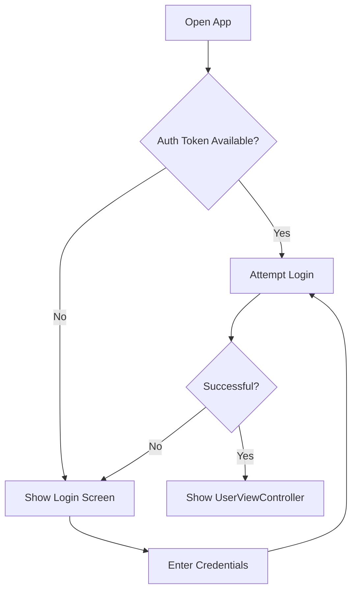

# Authentication in React

Authentication di React digunakan untuk memberikan akses spesifik kepada pengguna yang berhak. Proses autentikasi ini meliputi registrasi pengguna baru, login, dan pengelolaan akses ke route atau halaman tertentu di dalam aplikasi.

## Full Authentication Workflow

### 1. Registrasi Pengguna

- **Step 1**: Mengirim data pengguna seperti `username` dan `password` melalui permintaan POST - (Frontend)
- **Step 2**: Menyimpan data pengguna di database - (Backend)
- **Step 3**: Mengembalikan pesan respons kepada pengguna - (Frontend)

### 2. User Login

- **Step 1**: Mengirim data login (`username`, `password`) melalui permintaan POST - (Frontend)
- **Step 2**: Mengotentikasi pengguna dan membuat JSON Web Token (JWT) sebagai bukti autentikasi - (Backend)
- **Step 3**: Mengembalikan JWT sebagai respons kepada pengguna - (Frontend)

### 3. Mengakses Route yang Terbatas

- **Step 4**: Mengirim permintaan data dengan menyertakan JWT pada header permintaan - (Frontend)
- **Step 5**: Memeriksa tanda tangan JWT untuk memverifikasi identitas pengguna - (Backend)
- **Step 6**: Mengembalikan data atau akses berdasarkan otoritas pengguna - (Frontend)

## Login with React

Login dalam React adalah proses di mana pengguna memasukkan kredensial mereka untuk mendapatkan akses ke aplikasi. Proses ini mengelola autentikasi dan pengalihan tampilan berdasarkan status login.

### Contoh Alur Login Sederhana

# Alur Login

### 1. Open App

- Pengguna membuka aplikasi, dan proses autentikasi dimulai.

### 2. Auth Token Available?

- Sistem memeriksa apakah token autentikasi sudah tersedia.
  - **Jika Ya:** Aplikasi langsung melakukan **Attempt Login** (mencoba login otomatis menggunakan token).
  - **Jika Tidak:** Aplikasi menampilkan **Show Login Screen**.

### 3. Show Login Screen

- Pengguna melihat layar login dan diminta untuk memasukkan kredensial (username dan password).

### 4. Enter Credentials

- Pengguna memasukkan kredensial yang diperlukan untuk login.

### 5. Attempt Login

- Sistem mencoba memproses login dengan kredensial yang dimasukkan atau token yang tersedia.

### 6. Successful?

- Sistem memeriksa apakah autentikasi berhasil.
  - **Jika Ya:** Aplikasi menampilkan **UserViewController** sebagai halaman utama yang dapat diakses setelah login.
  - **Jika Tidak:** Aplikasi kembali ke **Show Login Screen** agar pengguna dapat mencoba login ulang.
