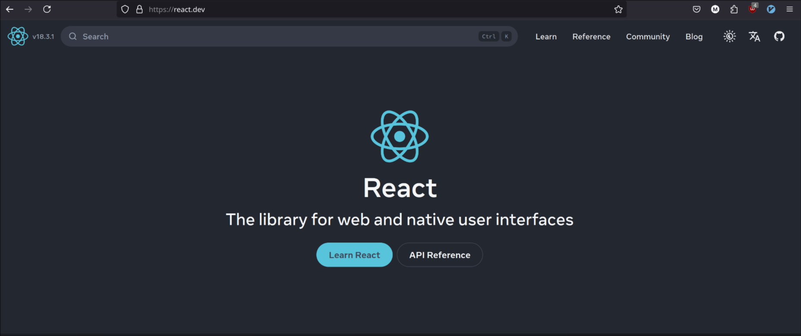

# Analisis Desain Web Berkelanjutan pada React.dev

Website [React.dev](https://react.dev/) adalah contoh penerapan beberapa prinsip desain web berkelanjutan. Berikut ini adalah elemen-elemen yang menunjukkan implementasi dari prinsip-prinsip tersebut:

## 1. Sederhanakan User Experience (UX)

React.dev memiliki tampilan sederhana dengan navigasi yang intuitif. Informasi diatur secara terstruktur, sehingga pengguna mudah menemukan konten yang mereka butuhkan tanpa elemen berlebihan. Pendekatan ini mengurangi waktu pencarian dan meminimalkan beban pemrosesan.

## 2. Optimalkan Penggunaan Gambar

React.dev menghindari penggunaan gambar besar atau yang tidak perlu. Sebagian besar halaman didominasi oleh teks dan diagram sederhana, sehingga menghemat bandwidth dan mempercepat waktu loading.

## 3. Optimasi Penggunaan Warna

Palet warna React.dev cenderung minimalis dan netral, menghindari warna-warna cerah yang meningkatkan konsumsi daya pada layar OLED. Penggunaan warna yang sederhana ini juga memberikan kesan profesional dan fokus pada konten.

## 4. Perhatikan Motion dan Animasi

Animasi di React.dev digunakan secara minimal dan hanya pada elemen yang memberikan nilai fungsional, seperti transisi halaman. Hal ini mengurangi konsumsi energi dan memberikan pengalaman yang lebih responsif dan efisien.

## 5. Efisiensi Tipografi Web

React.dev menggunakan font yang ringan dan efisien, dengan hanya beberapa variasi gaya. Font ini di-host secara lokal atau di-cache dengan baik, memastikan waktu loading yang cepat tanpa banyak permintaan eksternal.

Secara keseluruhan, website React.dev memanfaatkan desain minimalis dan efisien untuk menyediakan pengalaman pengguna yang berkualitas sekaligus ramah lingkungan.
