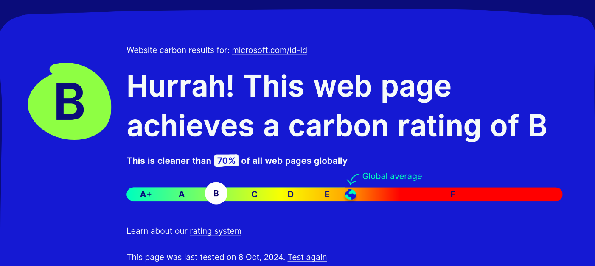

# Tantangan dalam Mengukur Jejak Karbon Website

1. **Tidak Ada Standar yang Universal**: Hingga saat ini, belum ada standar yang diterima secara universal untuk mengukur jejak karbon digital. Setiap metode atau alat pengukuran mungkin menghasilkan hasil yang berbeda.
2. **Sumber Energi Tidak Konsisten**: Banyak pusat data yang menggunakan campuran sumber energi yang bervariasi berdasarkan lokasi dan waktu. Hal ini menyebabkan sulitnya menghitung intensitas karbon dengan akurat.
3. **Perubahan Volume Lalu Lintas**: Website sering mengalami fluktuasi lalu lintas yang signifikan, yang memengaruhi jumlah data yang ditransfer dan energi yang dibutuhkan. Perhitungan tahunan menjadi kurang akurat tanpa adanya pemantauan rutin.
4. **Optimisasi Website yang Bervariasi**: Setiap website memiliki arsitektur dan tingkat optimisasi yang berbeda, sehingga konsumsi data dan energi bisa sangat berbeda antar website.
5. **Data Tidak Langsung Terbuka**: Tidak semua informasi tentang konsumsi energi pusat data, intensitas karbon listrik, atau transfer data tersedia untuk umum, sehingga pengukuran sering kali berbasis perkiraan.

---

# Hasil Pengukuran Jejak Karbon Website Microsoft

- **URL Website**: [https://www.microsoft.com/id-id](https://www.microsoft.com/id-id)
- **Rating Karbon Website**: **B**
- **Peringkat Global**: Situs ini lebih ramah lingkungan dibandingkan **70% dari semua halaman web secara global**

## Penjelasan

Rating "B" menunjukkan bahwa situs web ini memiliki kinerja karbon yang cukup baik, namun masih ada ruang untuk peningkatan. Situs ini berhasil mengalahkan rata-rata global dalam hal efisiensi emisi karbon. Rating ini mengindikasikan bahwa situs ini cukup efisien dalam penggunaan energi, tetapi masih ada potensi untuk lebih mengurangi konsumsi energi dan emisi karbon.
